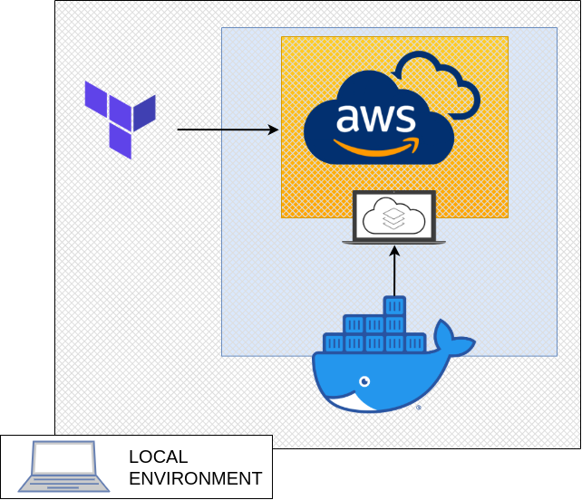

# Simple test with localstack using terraform

#### - localstack

[Localstack](https://github.com/localstack/localstack) is a simple way to simulation aws cloud stack. Giving a mock request/response from AWS api, provisioning per a [docker-compose.yaml](docker-compose.yaml).


#### - terraform

In this scenario, [terraform aws provider](https://registry.terraform.io/providers/hashicorp/aws/latest/docs) have flags who possibility communication with the localstack with they endpoints. The [main.tf](terraform/main.tf) have the "provider" defininetions. The other .tf files is just simple terraform provisioning intfraestrutucture test.

#### - use

Requirements

+ Docker Desktop installed and running

```
docker-compose up .

```

#### - diagram

